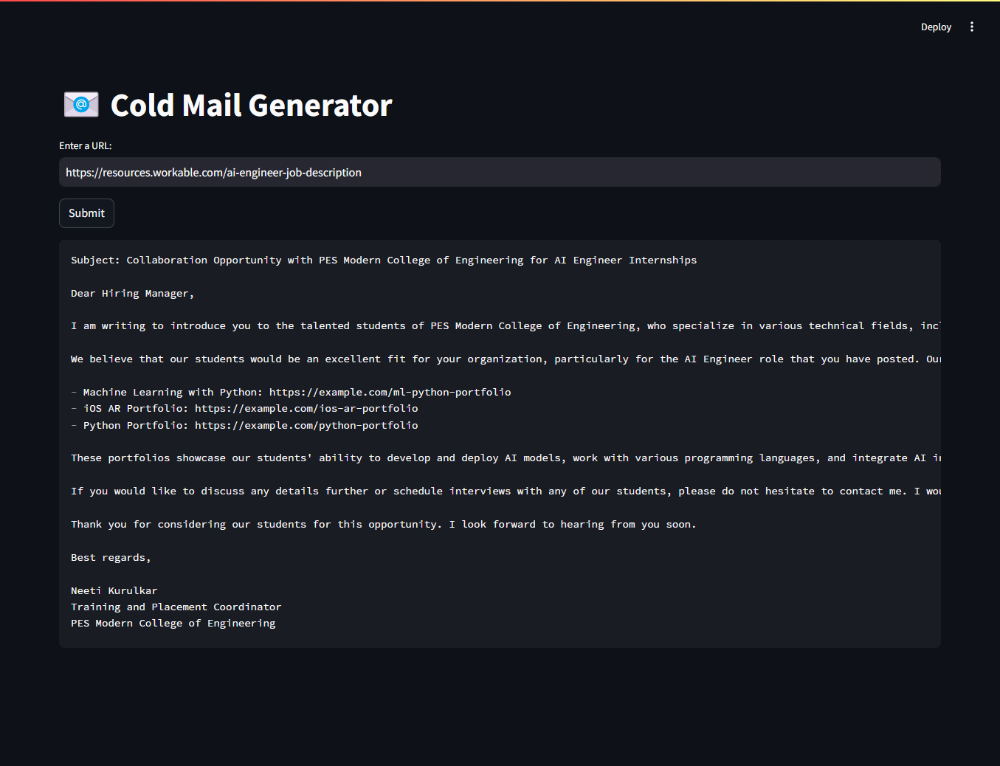

# 📧 Cold E-Mail Generator

## Overview

The Cold Email Generator is a web application designed to help users create personalized cold emails efficiently. By inputting key details about a job posting and their skills, users can generate tailored email templates suitable for outreach.

**Scenario:**
You are the Co-ordinator of the Training and Placement Cell at PES Modern College of Engineering. You are reaching out to the Hiring Manager of the company that has an opening for college interns via a cold email.


## Technologies Used

- **Streamlit**: A fast and easy way to build web applications for machine learning and data science projects.
- **LangChain**: A framework for building applications powered by language models.
- **ChromaDB**: A vector database that stores embeddings for fast retrieval.

## Features

- User-friendly interface to input job details and skills.
- Generates personalized cold email templates.
- Quick and efficient processing for seamless user experience.

## Set-up
- To get started, you need to get an API_KEY from https://console.groq.com/keys. Inside `app/.env` update the value of `GROQ_API_KEY` with the API_KEY you created. 

## Installation

To run the Cold Email Generator locally, follow these steps:

1. **Clone the repository**:

    ```bash
    git clone https://github.com/neeti-kurulkar/cold-email-generator.git
    cd cold-email-generator
    ```

2. **Create a virtual environment** (optional but recommended):

    ```bash
    python -m venv myenv
    source myenv/bin/activate  # On Windows use `myenv\Scripts\activate`
    ```

3. **Install the required packages**:

    ```bash
    pip install -r requirements.txt
    ```

4. **Run the application**:

    ```bash
    streamlit run app/main.py
    ```

5. **Open your browser** and go to `http://localhost:8501` to view the app.

## Usage

- Enter the URL of the job posting.
- Provide your skills related to the job.
- Click on the "Generate" button to create your cold email.

## License

This project is licensed under the MIT License. See the [LICENSE](LICENSE) file for details.
   

## Final Application: 
